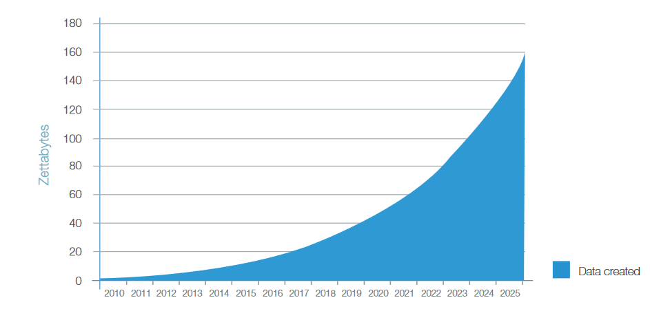
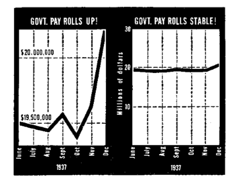
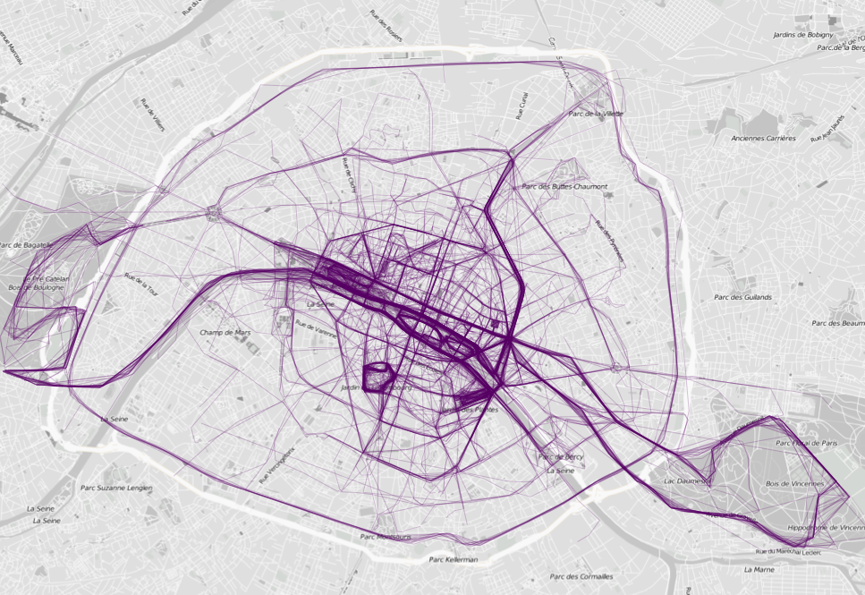
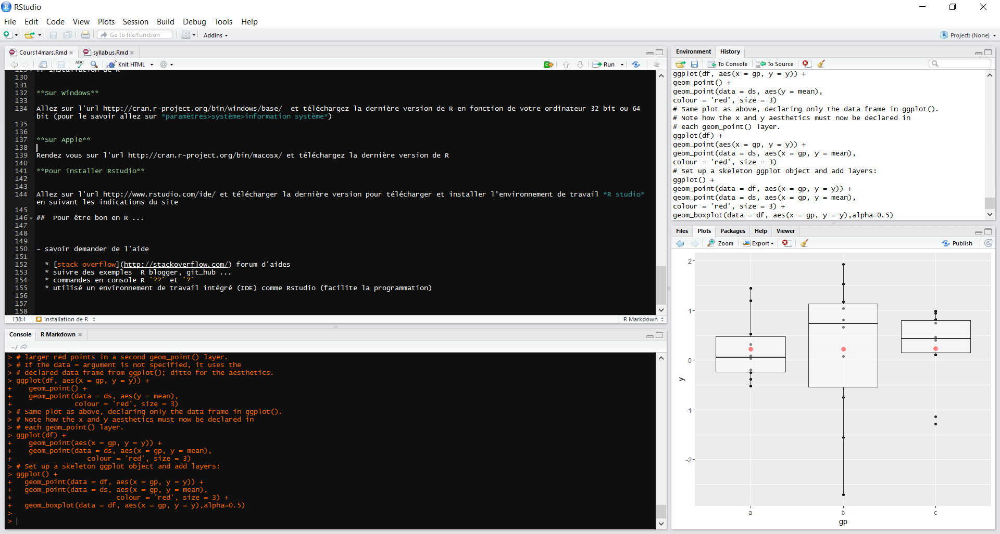
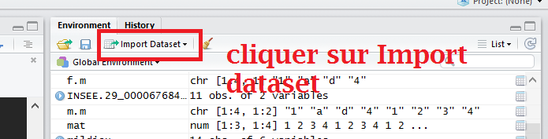
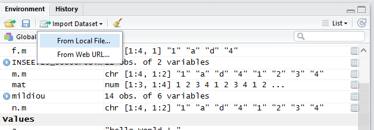

```{r setup, include=FALSE}
knitr::opts_chunk$set(echo = T)
```

## Plan du module

Ce cours est un TD de data science/visualisation. Pour ce faire, nous utiliserons un langage interprété de haut niveau statistique **R** et l'environnement de développement intégré *(EDI fr, IDE en)* **Rstudio**. Les différents points abordés durant ces 15 heures de cours sont:

<https://laurentpolitis.github.io/FIN406_2017/docs/index.html#themes-abordesrst>

-   Extraction et manipulation des données (data mining)
-   Représentations graphiques (data visualisation)
-   Valorisations de ces données par le biais de méthodes statistiques
-   Représentations graphiques interactives (html widget, plotly ...)
-   Shiny et **Rmarkdown** création d'application et de rapport interactif (rapport TD à rendre idéalement sous .Rmd)

## Plan du module

**Evaluation :**

-   choisir un **sujet de data science en lien avec votre mémoire** de fin d'année par équipe de 2
-   rendre un **rapport en format .Rmd** (idéalement) de data mining et de data visualisation avec les fichiers sources associés (.csv, script .R, ...)
-   Questionnaire (devoir sur table)

<http://laurentpolitis.github.io/Data_Viz_Fin403/Cours_20_avril.html>

## Plan de ce cours

Les 3 premières heures seront consacrées à une introduction sur la data science et des rappels sur R

-   Définition et cadre

**Extraction et manipulation de données (data mining)**

-   Principe de base de la data visualisation (infographie)

-   Rappels sur R

    -   Objets R (variable, programme et fonction)
    -   importer des données depuis le web
    -   graphiques simples

## Contexte

```{r message=FALSE, warning=FALSE, paged.print=FALSE}
#install.packages(c("tm", "SnowballC", "wordcloud", "RColorBrewer", "RCurl", "XML"))
source('http://www.sthda.com/upload/rquery_wordcloud.r')
res<-rquery.wordcloud("https://www.r-bloggers.com/", type ="url", lang = "english",excludeWords =tolower(c(month.name,"the","and","you","|")))
```

<https://fr.wikipedia.org/wiki/Big_data>

## Une Réalité *Big Data*

<https://www.seagate.com/fr/fr/our-story/data-age-2025>

$$ 1 Zo \simeq 10^{12} Go $$

De 3500 avant J.C, jusqu'à l'an 2000 l'Homme a accumulé $5\,000\,000\,000 Go \simeq 0.005 Zo$. En 2025, les projections annonce $40 Zo$

::: {.notes}
kilooctet ko 103 210 mégaoctet Mo 106 220 gigaoctet Go 109 230 téraoctet To 1012 240 pétaoctet Po 1015 250 exaoctet Eo 1018 260 zettaoctet Zo 1021 270 yottaoctet Yo 1024 280
:::

<CENTER>



</CENTER>

## Méga Données ?

<CENTER>


</CENTER>

## Définition *Big Data*

*"Big data is a term that describes large volumes of high velocity, complex and variable data that require **advanced techniques** and technologies to enable the capture, storage, distribution, management, and analysis of the information."*

[TechAmerica Foundation's Federal Big Data Commission, 2012](https://www.sciencedirect.com/science/article/pii/S0268401214001066)

## Besoin d'analyse

```{r BIGDATA, fig.height=3, fig.width=8, message=FALSE, warning=FALSE, paged.print=FALSE}
library(readr)
library(ggplot2)
library(ggthemes)
multiTimeline <- read_csv("data/multiTimeline.csv",skip = 2)
multiTimeline$date <- paste0(multiTimeline$Mois,"-15")
ggplot2::ggplot(multiTimeline,aes(as.Date(date),multiTimeline$`Big data: (Dans tous les pays)`)) + geom_line(size=1) +
  geom_smooth(se = FALSE)+ theme_igray()+
  labs(x="Date",y="Recherche en %", title="Big Data",subtitle="Fréquence des recherches du mot Big Data depuis 2004",caption="https://trends.google.com/trends/explore?date=all&q=Big%20data")


```

## des outils, méthodes ...

<CENTER>


</CENTER>

```{=html}
<!-- Data science 

<!-- Data mining  -->
```
<!-- Machine Learning  -->

<!-- Deep Learning  -->

## Pourquoi R ?

<https://laurentpolitis.github.io/FIN406_2017/docs/intro.html>

## Installation de R et de Rstudio

Liens pour installer R

<https://jjallaire.shinyapps.io/learnr-tutorial-00-setup/>

<https://laurentpolitis.github.io/FIN406_2017/docs/intro.html#pourquoi-r>

## Data visualation

Définition

-   communiquer des données de façon visuelle

-   [](https://www.google.fr/url?sa=t&rct=j&q=&esrc=s&source=web&cd=3&cad=rja&uact=8&ved=0ahUKEwifmvOmyLTLAhVpGZoKHfHTCVIQFggtMAI&url=http%3A%2F%2Fwww.hominides.com%2Fhtml%2Factualites%2Fvolcan-chauvet-art-parietal-0997.php&usg=AFQjCNEkHHN2mcgvHqIeMiFzsxQeHOghKw&sig2=M_S-Hnbu-FnwG4XA6kE_yg)

-   transformer des données en information

-   résultats graphiques clairs et compréhensibles

## Exemple

-    [une des premières data visualisation](https://fr.wikipedia.org/wiki/Charles_Joseph_Minard)

-   <http://esri.github.io/wind-js/> SIG

-   <https://showyourstripes.info/> séries temporelles

-   <http://www.nytimes.com/interactive/2015/03/19/upshot/3d-yield-curve-economic-growth.html> 3D

## Principes d'infographie

-   mémoire courte quelques secondes d'attention ou de réflexion

-   un max de $\simeq 11$ types de couleurs ou de styles différents facilement distinguables

-   notion de perspective données et vérités

-    source "How to Lie With Statistics", 1954, *Huff*

## Science sous jacente les statistiques

 source "How to Lie With Statistics", 1954, *Huff*

## Mathématiques, géométrie et données

sous-jacentes déterminent l'allure du graphique et influence le lecteur

<center>


<center/>

## Mathématiques, géométrie et données

<center>


<center/>

## Un graphe une histoires dif.

<center>


<center/>

Pour rappel, Clinton a perdu l'élection 242 "county" contre 2,232 pour Trump. Cependant, au vote populaire Clinton passe devant Trump avec respectivement 50.5% et 49.5% des votes en sa faveur.

## Un graphique vaut mille mots

```{r motss, echo=FALSE, message=FALSE}
library(ggplot2)
df = data.frame(x=rnorm(1:84),y=rnorm(1:84),
                lettres=LETTERS[rep(seq( from = 1, to = 28 ),3)])

df[!complete.cases(df),"lettres"]="A"
df$test= ifelse(df$lettres=="A","A","pas A")
ggplot(df,aes(x=x,y=y))+geom_text(aes(label=lettres))
#ggplot(df,aes(x=x,y=y,colour=test))+geom_text(aes(label=lettres))

```

## Combien y a t il de A ?

```{r mot1, fig.height=4}
ggplot(df,aes(x=x,y=y,colour=test,size=test))+geom_text(aes(label=lettres))+labs(colour="",size="")+scale_color_manual(values = c("red","black"))+scale_size_manual(values = c(6.5,4))

```

-   Réponse : `r sum(df$lettres == "A")`

<!-- ## Regardons le code  -->

<!-- ```{r mot_description, echo=TRUE, message=TRUE,eval=FALSE} -->

<!-- # Partie setup  -->

<!-- library(ggplot2) -->

<!-- # Partie data mining et calcul  -->

<!-- df = data.frame(x=rnorm(1:87),y=rnorm(1:87), -->

<!--                 lettres=LETTERS[rep(seq( from = 1, to = 27 ),3)]) -->

<!-- df[!complete.cases(df),"lettres"]="A" -->

<!-- df$test= ifelse(df$lettres=="A","A","pas A") -->

<!-- # Partie data visualisation -->

<!-- ggplot(df,aes(x=x,y=y))+geom_text(aes(label=lettres)) -->

<!-- #ggplot(df,aes(x=x,y=y,colour=test))+geom_text(aes(label=lettres)) -->

<!-- ``` -->

## Pourquoi R

-   Open source & Gratuit

-   Facile à installer sur les systèmes d'exploitations Linux, Windows et Apple

-   Une très grosse communauté de développeurs et d'utilisateurs

-   Facile à utiliser pour des non-programmeurs pour des calculs statistiques

-   Possibilité de créer des illustrations, applications web et même la présentation que vous lisez actuellement

    {width="300" height="150"}

## Installation de R

**Sur Windows**

<http://cran.r-project.org/bin/windows/base/>

télécharger la dernière version de R en fonction de votre ordinateur 32 bit ou 64 bit (pour le savoir aller sur *paramétres\>système\>information système*)

**Sur Apple**

<http://cran.r-project.org/bin/macosx/> et télécharger la dernières version de R

**Pour installer Rstudio**

<http://www.rstudio.com/ide/> pour télécharger la dernières version et installer l'environnement de travail *R studio* en suivant les indications du site

## Pour être bon en R ...

-   savoir demander de l'aide une qualité essentielle d'un programmeur

    -   [stack overflow](http://stackoverflow.com/) forum en ligne
    -   suivre des exemples R blogger, git_hub ...
    -   commandes en console R `??` et `?`
    -   utiliser un environnement de travail intégré (IDE) comme Rstudio (facilite la programmation, auto indentation, variables historiques, etc ...)

## Présentation de l'IDE Rstudio



## Codes sources, programmes et scripts


## Codes sources, programmes et scripts

-   créer un fichier texte hello.R
-   écrire votre premier programme en R

```{r premier_prog, echo=TRUE, message=TRUE,eval=FALSE}
#  le Diése sert à commenter le reste de la la ligne  
# tout ce qui est écrit ici ne sera pas exécuté par R  
# indiquer le but du programme ou toutes autres informations  
# Nom  et Prénom dates 
a <- "hello World ! "
b = pi
print(a)
print(paste("pi is equal to",b))


```

## Comment l'exécuter ?

A l'aide de la console R :


```{r premier_prog_console, echo=TRUE, message=TRUE,eval=TRUE}
source("cours_data_visualisation/hello.R")

```

## L'environnement de R

Ce qui a changé


-   Ajout de la commande lancée dans l'historique
-   Ajout des variables `a` et `b` dans l'environnement R (commande ls() pour lister les objets)

## Les variables dans R

```{r console, echo=TRUE, message=TRUE,eval=TRUE}
class(a)

b <- 1 
class(b)

#vecteurs
c <- c(1,2,3,4)
d <- c("a","b","c","d")
e <- c("a"=1,"b"=2,"c"=3,"d"=4)
f <- c(1,"a","d",4)


```

## Les vecteurs

```{r fonction_vec, echo=TRUE, message=TRUE,eval=TRUE}
length(x = c)
names(x=e)
# accéder à un élement
c[1]
e["a"]
# ou plusieurs
c[1:2]
e[c("a","c")]
```

```{python}
c = [1,2,3,4]
len(c)
```

## Les facteurs

```{r factor, echo=TRUE, message=TRUE,eval=TRUE}

ff<-factor(1:10)

f <- factor(1:10,levels = seq(from = 10,to = 1,by = -1))

ff

f

as.numeric(as.character(ff))

as.numeric(ff)

```

## et les classes

```{r variables, echo=TRUE, message=TRUE,eval=TRUE}
class(c)
class(d)
class(e)
class(f)
```

attention f ne pas mélanger les types de variables

## Les Matrices

```{r matrix, echo=TRUE, message=TRUE}
f.m <- cbind(f)
f.m
c.m <- cbind(c)
c.m
```

## Matrices numériques ou caractères

```{r matrix1, echo=TRUE, message=TRUE}
m.m <- cbind(f.m,f.m)
m.m
n.m <- cbind(c.m,c.m)
n.m
```

## Matrices et Data frames

```{r dataframe, echo=TRUE, message=TRUE}
mat <- matrix(data = rep(c.m,3), ncol=3,nrow = 4)
mat
df = data.frame("numeriques"= 1:4, lettres=c("A","B","C","D"),stringsAsFactors = F)
df 
```

## Matrices et Data frames

```{r dataframe1, echo=TRUE, message=TRUE}
class(mat[,1])
class(df[,"numeriques"])
class(df[,"lettres"])
```

## Matrices Vs Data frames

Quelle est l'avantange d'une matrice par rapport à une data frame ?

```{r sizedataframe, message=TRUE, include=FALSE}
object.size(mat)
object.size(as.data.frame(mat))

```

## Passer d'un type à l'autre

```{r as, echo=TRUE, message=TRUE}
as.matrix(df)
as.numeric(f)

```

## Relation logique

```{r logique, echo=TRUE, message=TRUE}
1==0
1>=0
1<=0
"a" == "b"
```

## Fonctions

les commandes matrix(), cbind(), data.frame() sont des fonctions codées

**Définition**

[](http://biol09.biol.umontreal.ca/BIO2041e/CreerFonctionR.pdf)

-   un objet R
-   des commandes R écrites dans un fichier qui effectuent une tâche prédéfinie
-   permet de faire automatiquement la même tâche plusieurs fois
-   garder un programme plus lisible
-   un gain de temps à long terme

## Ecrire votre première fonction

écrire le même code que précédemment (page 27 de la présentation) sous forme de fonction dans un nouveau fichier hello_fun.R

```{r fonction2, echo=TRUE, message=TRUE}
hello <-function(texte=NULL){   # argument ou données d'entrées

  #code manipulant les données d'entrée
 
return(texte)  #  return  renvoie le résultat de la fonction  
}
 source("cours_data_visualisation/hello_fun.R")

 hello("hello world !")
```

## Un peu plus compliqué

Un petit ajout le nom de l'utilisateur

```{r fonction1, echo=TRUE, message=TRUE}
hello <-function(texte=NULL){  
  #on souhaite coller le nom de l'utilisateur à "hello world"
  # on récupére le nom de l'utilisateur 
 nom <- Sys.getenv("USERNAME") # fonction trouvée via une recherche web
   # on colle le nom de l'utilisateur
 texte <- paste(texte,"and",nom)
 
return(texte)  #  return  renvoie le résultat de la fonction  
}

 # source("cours_data_visualisation/hello_fun2.R")

 hello("hello world")
```

## Fonction cor()

Vous avez écrit une fonction comme les fonctions de base de R, comme par exemple cor() qui calcule la corrélation des données de deux vecteurs ou des données contenues dans une matrice

```{r fonction, echo=TRUE, message=TRUE}
nrow
?cor
cor(rnorm(n = 100,mean = 1,sd = 0.25),rnorm(n = 100,mean = 1,sd = 25))
```

## Les boucles

Calculer $n!$ avec $n=10$.

```{r for, echo=TRUE, fig.height=4, message=FALSE, warning=FALSE, paged.print=FALSE}
factorielle <-1
for (i in seq(1, 10)){
  factorielle <- factorielle*i
}
print(factorielle)

```

$$
n! = \prod_{1\leqslant i\leqslant n} i = 1\times 2\times 3\times \ldots \times (n-1) \times n.
$$

## Vérification

On vérifie avec la fonction déjà codée.

$$
\Gamma(n) = (n-1)!\qquad n \in \mathbb{N}_0
$$

```{r echo=TRUE}
factorial(10)


```

```{r echo=FALSE, fig.height=3}

  qplot(1:1000/100,gamma((1:1000)/100)) + ggthemes::theme_fivethirtyeight() + labs(title="Fonction gamma")+ annotate(x=9,y=gamma(10),label=gamma(10),geom="text",col="red")+
    geom_point(aes(x=10,y=gamma(10)),colour="red")+scale_y_log10()
```

## Importer des données

Importer des données via git_hub autrefois quandl

Par exemple l'évolution de la population à Angers

<https://raw.githubusercontent.com/LaurentPolitis/Cours_FIN403/master/Cours_1/data/angers_pop.csv>

-   Télécharger les données sous format .csv
-   ouvrir les données via R méthode graphique 

## Importer des données sous R

Import Dataset \> from Local File 

Puis vérifier que les données sont sous le bon format


## Importer des données sous console R

```{r importer,  echo=TRUE, message=TRUE}
#install.packages("Quandl")
# library(Quandl)
# Quandl("CITYPOP/CITY_ANGERSPAYFRANCE")
library(readr)

angers_pop <- read_delim("https://raw.githubusercontent.com/LaurentPolitis/Cours_FIN403/master/Cours_1/data/angers_pop.csv", "\t", escape_double = FALSE, trim_ws = TRUE)

class(angers_pop)

```

## Visualiser les données

```{r view,echo=TRUE, message=TRUE,eval=FALSE}
INSEE.29_000067684_A <- angers_pop
View(INSEE.29_000067684_A)
```

```{r,echo=FALSE, message=FALSE,eval=TRUE}
INSEE.29_000067684_A <- angers_pop
```


## Visualiser les données

```{r plot,echo=TRUE, message=TRUE,eval=TRUE}
plot(x = as.Date(INSEE.29_000067684_A$Year),y=
       INSEE.29_000067684_A$Population)

```

## Changer le style du graphe

```{r plot1,echo=TRUE, message=TRUE,eval=TRUE}
plot(x = as.Date(INSEE.29_000067684_A$Year),y=
       INSEE.29_000067684_A$Population,type = "l")

```

## Changer le style du graphe

```{r plot3,echo=TRUE, message=TRUE,eval=TRUE}
plot(x = as.Date(INSEE.29_000067684_A$Year),y=
       INSEE.29_000067684_A$Population,type = "b")

```

## Légendes

```{r plot2,echo=TRUE, message=TRUE,eval=TRUE}
plot(x = as.Date(INSEE.29_000067684_A$Year),y=
       INSEE.29_000067684_A$Population,type = "l",xlab ="Dates" ,
     ylab="populations")

```

C'était l'outil classique de création de graphe de R "plot()". Le prochain cours je vous présenterais "la grammaire graphique" avec ggplot2.

## Introduction ggplot

Les graphiques que nous allons créer aujourd'hui sont :

-   Les boites à moustaches
-   Les histogrammes
-   Les courbes de densité
-   Nuage de points, séries temporelles et graphiques diagnostics de modélisation statistiques...

## Rappel Data mining

Les données utilisées sont la population des communes de 1968 à 2012 :

<http://www.insee.fr/>

La fonction ci-dessous permet de la télécharger.

```{r datamining}
# setwd("~/data-visualisationFIN403/") # pour se placer dans le répertoire courant 

source("https://raw.githubusercontent.com/LaurentPolitis/Cours_FIN403/master/Cours_1/cours_data_visualisation/data_mining_communes.R") # charge la fonction data_import()


View(population_ville)

```

## GGplot

Une librairie R de visualisation de données développée par Hadley Wickham en 2005 selon les principes énoncés par Leland Wilkinson dans son ouvrage [The Grammar of Graphics](http://byrneslab.net/classes/biol607/readings/wickham_layered-grammar.pdf)

-   Plot = data + Aesthetics + Geometry
-   *Aesthetics* (aes) : les couleurs, les tailles, les formes, les labels mais aussi les données en x et en y
-   *Geometry* (geom\_ ...) va regrouper les options concernant les types de graphique (line, point, histogramme, heatmap, boxplot, etc.)
-   peut-être stocké dans l'objet

```{r ggplot2,eval=FALSE}
#install.packages(ggplot2)
library(ggplot2)

```

## Les boites à moustaches

-   moyen rapide de résumer une série statistique quantitative
-   inventée en 1977 par John Tukey

```{r boxplots,eval=FALSE}
library(ggplot2)
ggplot(population_ville) + geom_boxplot(aes(x="France",y= `Population en 2012 (princ)` ))

```

## Les boites à moustaches exemple

```{r boxplots1,echo=FALSE}
library(ggplot2)
ggplot(population_ville) + geom_boxplot(aes(x="France",y= `Population en 2012 (princ)`))

```

## Modifier l'échelle des axes

```{r}
ggplot(population_ville) + geom_boxplot(aes(`Population en 2012 (princ)`,x="ville"))+
 scale_y_sqrt()
```

## Echelle en log

```{r,warning=FALSE}
ggplot(population_ville) + geom_boxplot(aes(`Population en 2012 (princ)`,x="ville")) +
 scale_y_log10()
```

## Faire ressortir la ville d'Angers

```{r,warning=FALSE, fig.height=3.5, fig.width=5, warning=FALSE}
ggplot(population_ville) + geom_boxplot(aes(y=`Population en 2012 (princ)`,x="France"))+ 
scale_y_log10() + geom_point(data= population_ville[population_ville$Communes=="Angers",],
                             aes(y = `Population en 2012 (princ)` ,x='France'),color="red",size=4)

```

## Sans GGplot

```{r,warning=FALSE,  warning=FALSE}
boxplot(population_ville$`Population en 2012 (princ)`,log="y", ylim=c(100,100000000))

```

## Par régions

```{r,warning=FALSE, fig.height=4.5, fig.width=9, warning=FALSE}
ggplot(population_ville) + geom_boxplot(aes(y=(`Population en 2012 (princ)`),x=Region,group=Region))+
  scale_y_log10() + coord_flip()
```

## Mettre en valeur deux sous classes de région

```{r,warning=FALSE, fig.height=3.5, fig.width=8, warning=FALSE}
population_ville$dom_tom = population_ville$Region %in% 
  c("Martinique","Guyane","Guadeloupe","Martinique","La Réunion")
p = ggplot(population_ville,aes(y=`Population en 2012 (princ)`,x=Region,group=Region)) +  scale_y_log10() + 
  coord_flip()
 p+ geom_boxplot(aes(fill=dom_tom))
```

## Des Box plots plus exotiques

```{r,warning=FALSE, fig.height=5, fig.width=8, warning=FALSE}

p + geom_violin()

```

## Des Box plots plus exotiques

```{r,warning=FALSE, fig.height=5, fig.width=8, warning=FALSE}

p  +geom_jitter(alpha=0.1) + geom_boxplot(alpha=0.7)

```

## Courbe de densité de probabilité

```{r density,warning=FALSE}
ggplot(population_ville) + geom_density(aes(x = `Population en 2012 (princ)`)) 

```

## Echelles

```{r density1,warning=FALSE}
ggplot(population_ville) + geom_density(aes(x = `Population en 2012 (princ)`)) +scale_x_log10()

```

## plusieurs graphes en un même

```{r density2,fig.width=11,fig.height=4,warning=FALSE}
ggplot(population_ville) + geom_density(aes(x = `Population en 2012 (princ)`,
                                            fill="kernel density \n estimation")) +
  scale_x_log10() +facet_wrap(facets=~Region)

```

## Les histogrammes

```{r histogramme}
ggplot(population_ville,aes(x=`Population en 2012 (princ)`)) + geom_histogram(binwidth = 10000)

```

## Zoom sur une région

```{r histogramme1,fig.height=4.5}
ggplot(population_ville[population_ville$Region=="Bretagne",],aes(x=`Population en 2012 (princ)`,fill=Communes)) +
  geom_histogram(binwidth = 1000) +
  scale_y_sqrt()+facet_wrap(facets = ~Communes)
```

## Les séries temporelles

```{r timeseries,warning=FALSE,fig.height=3,fig.width=10,,message=FALSE}
library(reshape2)
tmp=population_ville[population_ville$Region=="Bretagne",c(4:10)]
tmp.m=melt(tmp)
tmp.m$variable=as.numeric(substr(x = tmp.m$variable,15,18))
colnames(tmp.m)[1] = "Communes"
ggplot(tmp.m) + geom_line(aes(x=as.Date(paste(tmp.m$variable,"-01-01",sep="")),y=value,group=Communes))+scale_y_log10()+labs(x="Date")
```

## Smooth

```{r newtimeseries,warning=FALSE,fig.height=3,fig.width=10,,message=FALSE}
library(reshape2)
tmp=population_ville[population_ville$Region=="Bretagne",c(4:10)]
tmp.m=melt(tmp)
tmp.m$variable=as.numeric(substr(x = tmp.m$variable,15,18))
colnames(tmp.m)[1] = "Communes"
ggplot(tmp.m) + geom_smooth(aes(x=as.Date(paste(tmp.m$variable,"-01-01",sep="")),y=value,group=Communes),color="black")+scale_y_log10()+labs(x="Date")
```

## rendre visible le graphique

```{r timeseries1,eval=FALSE}

tmp.m$Vannes=tmp.m$Communes=="Vannes" #"#CFCDCD", "#FFFFFF"

tmp.m=tmp.m[tmp.m$value>15000,]

ggplot(tmp.m) + geom_line(aes(x=as.Date(paste(tmp.m$variable,"-01-01",sep="")),
                              y=value,group=Communes,color=Vannes,size=Vannes)
                         )+

scale_color_manual(values=c("#5E5C57", "red"))+
  scale_size_manual(values=c(1, 3))+
  geom_text(data=tmp.m[tmp.m$variable==2012,],aes(x = as.Date(paste(2012,"-01-01",sep=""))
,y=(value),label=Communes))

```

## souligné

```{r timeseries2,echo=FALSE}

tmp.m$Angers=tmp.m$Communes=="Vannes" #"#CFCDCD", "#FFFFFF"

tmp.m=tmp.m[tmp.m$value>15000,]

ggplot(tmp.m) + geom_line(aes(x=as.Date(paste(tmp.m$variable,"-01-01",sep="")),
                              y=value,group=Communes,colour=Angers,size=Angers))+
  scale_y_sqrt()  +
scale_color_manual(values=c("#5E5C57", "red"))+
  scale_size_manual(values=c(1, 3))+
  geom_text(data=tmp.m[tmp.m$variable==2012,],aes(x = as.Date(paste(2012,"-01-01",sep=""))
,y=(value),label=Communes))

```

## Graphiques et modélisation

```{r smooth}
ggplot(data = tmp.m[tmp.m$Communes=="Vannes",], aes(x = variable,  y =value)) +
  geom_point() +geom_smooth(se = F)
```

## Tendances à la hausse

```{r smooth1}
ggplot(data = tmp.m[tmp.m$Communes=="Vannes",], aes(x = variable,  y =value)) +
  geom_point() +geom_smooth(method = "lm")
```
