# Cours 13 avril
Laurent Politis  
12 avril 2016  


## Intro 
Les graphiques que nous allons créer aujourd'hui sont : 

 
* Les boites à moustaches 
* Les histogrammes 
* Les courbes de densité
* Nuage de points, séries temporelles et graphiques diagnostics de modélisation statistiques...

## Rappel Data mining 
Les  données utilisées sont la population des communes de 1968 à 2012 : 

http://www.insee.fr/fr/themes/detail.asp?reg_id=99&ref_id=base-cc-serie-historique

Une fonction sert à les nettoyer 

```r
setwd("~/data-visualisationFIN403/") # pour se placer dans le répertoire courant 

source("prog/data_mining_communes_fonction.R") # charge la fonction data_import()

population_ville = data_import() 

View(population_ville)
```


## GGplot 

Une librairie R de visualisation de données développée par Hadley Wickham en 2005 selon
les principes développés par Leland Wilkinson dans son ouvrage [The Grammar of Graphics](http://byrneslab.net/classes/biol607/readings/wickham_layered-grammar.pdf)

* Plot = data + Aesthetics + Geometry 
* *Aesthetics* (aes) :  les couleurs, les tailles, les formes, les labels mais aussi les données en x et en y
* *Geometry* (geom_ ...) va regrouper les options concernant les types de graphique (line, point, histogramme, heatmap, boxplot, etc.)
* peut-être stocké dans l'objet 


```r
install.packages(ggplot2)
library(ggplot2)
```

## les bases de GGplot 

La forme de base d'un graphique R est la suivante 


```r
ggplot(data_set) + plot_type(aes(x_variable,y_variable)) # pour une analyse univariée,
#on peut spécifier qu'une variable (x) comme par exemple dans le cas d'un box plot
```

plot_type specifies the type of plot that should be constructed. There are more than 35 different plot types in ggplot2. (The current version of the app, however, supports only 10 different plot types)


##  Les boites à moustaches 

* moyen rapide de résumer une série statistique quantitative
* inventée en 1977 par John Tukey


```r
library(ggplot2)
ggplot(population_ville) + geom_boxplot(aes(x="France",y= `Population 2012`))
```

##  Les boites à moustaches exemple

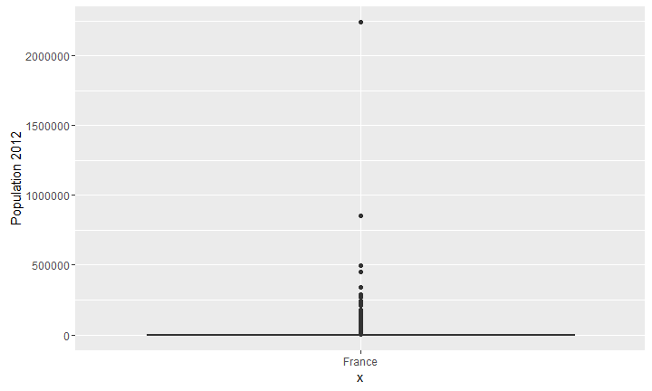<!-- -->

## Modifié l'échelle des axes 


```r
ggplot(population_ville) + geom_boxplot(aes(`Population 2012`,x="ville")) +
 scale_y_sqrt()
```

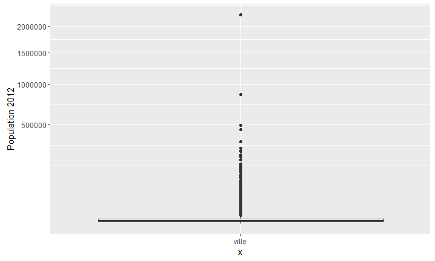<!-- -->

## Echelle en log


```r
ggplot(population_ville) + geom_boxplot(aes(`Population 2012`,x="ville")) +
 scale_y_log10()
```

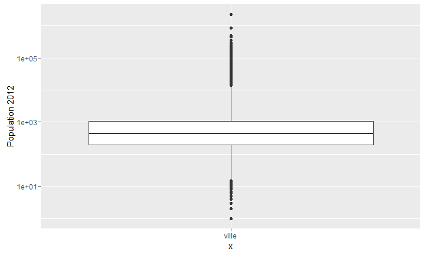<!-- -->

## Faire ressortir la ville d'Angers

```r
ggplot(population_ville) + geom_boxplot(aes(y=`Population 2012`,x="France")) + 
  scale_y_log10() + 
  geom_point(data= population_ville[population_ville$Communes=="Angers",],
             aes(y = `Population 2012` ,x='France'),color="red",size=4)
```

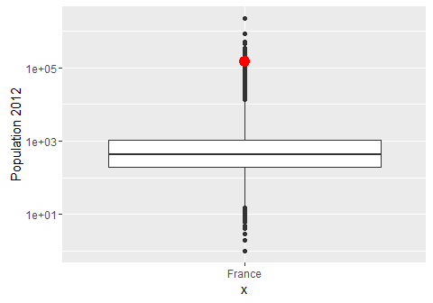<!-- -->


## Sans GGplot

```r
boxplot(population_ville$`Population 2012`,log="y", ylim=c(100,100000000))
```

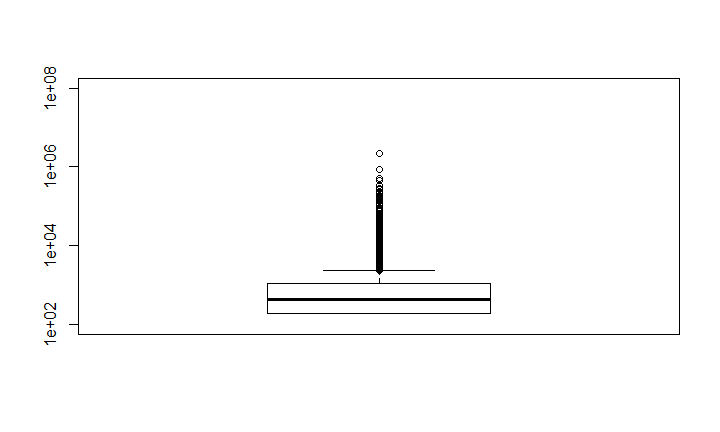<!-- -->

##  Par régions 

```r
ggplot(population_ville) + geom_boxplot(aes(y=`Population 2012`,x=Region,group=Region))+
  scale_y_log10() + coord_flip()
```

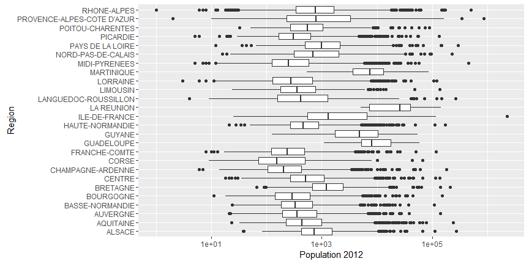<!-- -->

##   Mettre en valeur deux types de population 

```r
population_ville$dom_tom = population_ville$Region %in% 
  c("MARTINIQUE","GUYANE","GUADELOUPE","MARTINIQUE","LA REUNION")
p = ggplot(population_ville,aes(y=`Population 2012`,x=Region,group=Region)) +  scale_y_log10() + 
  coord_flip()
 p+ geom_boxplot(aes(fill=dom_tom))
```

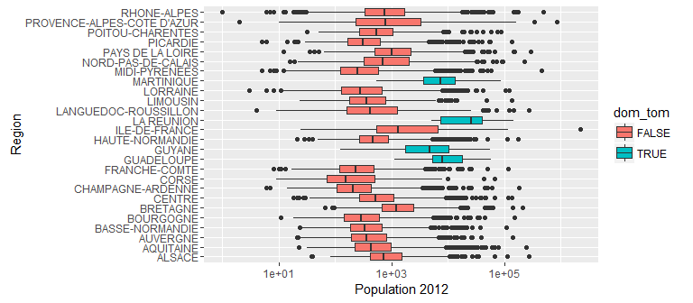<!-- -->

##  Des Box plots plus exotiques 

```r
p + geom_violin()
```

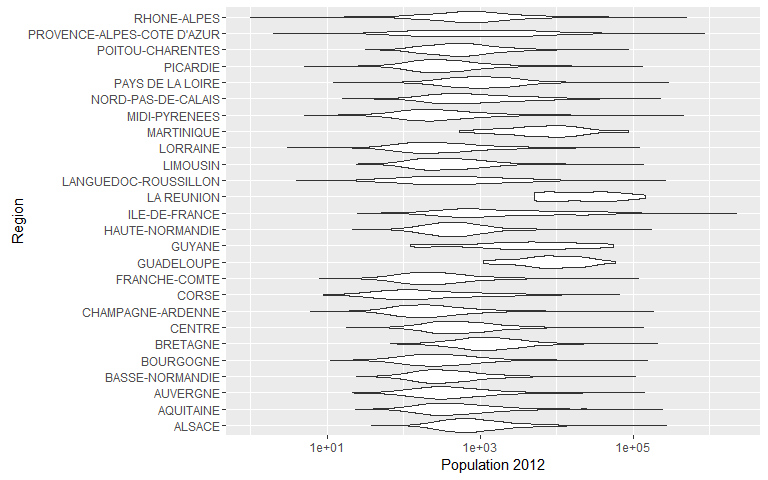<!-- -->

##  Des Box plots plus exotiques 

```r
p  +geom_jitter(alpha=0.1) + geom_boxplot(alpha=0.7)
```

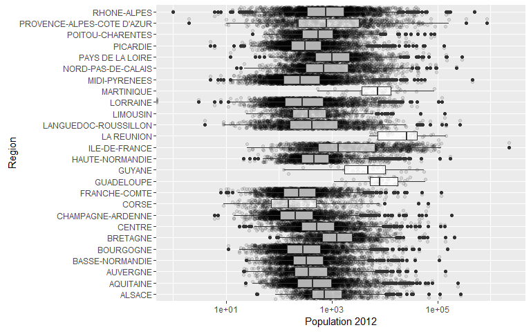<!-- -->


## Courbe de densité de probabilité

```r
ggplot(population_ville) + geom_density(aes(x = `Population 2012`)) 
```

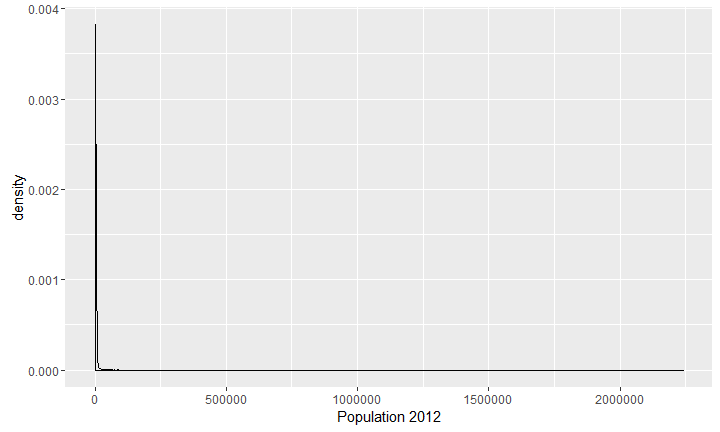<!-- -->

## Echelles

```r
ggplot(population_ville) + geom_density(aes(x = `Population 2012`)) +scale_x_log10()
```

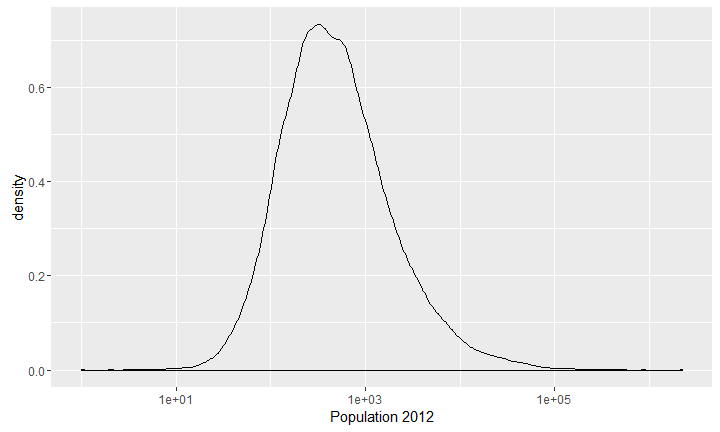<!-- -->

##  plusieurs graphes en un même

```r
ggplot(population_ville) + geom_density(aes(x = `Population 2012`,
                                            fill="kernel density \n estimation")) +
  scale_x_log10() +facet_wrap(facets=~Region)
```

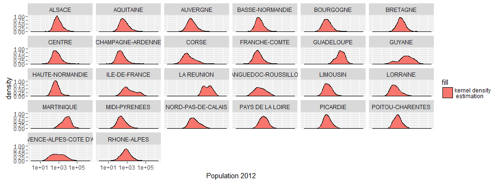<!-- -->


## Les histogrammes 


```r
ggplot(population_ville,aes(x=`Population 2012`)) + geom_histogram(binwidth = 10000)
```

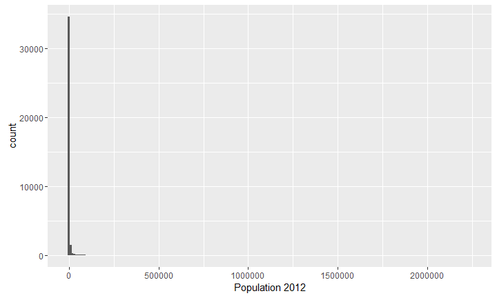<!-- -->

## Zoom sur une région 


```r
ggplot(population_ville[population_ville$Region=="BRETAGNE",],aes(x=`Population 2012`,fill=Departement)) +
  geom_histogram(binwidth = 1000) +
  scale_y_sqrt()+facet_wrap(facets = ~Departement)
```

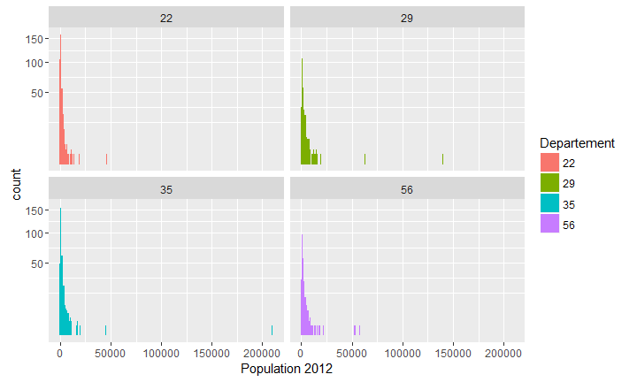<!-- -->

## Les séries temporelles 


```r
library(reshape2)
tmp=population_ville[population_ville$Region=="PAYS DE LA LOIRE",c(3,4:10)]
tmp.m=melt(tmp)
tmp.m$variable=as.numeric(substr(x = tmp.m$variable,12,15))
ggplot(tmp.m) + geom_line(aes(x=as.Date(paste(tmp.m$variable,"-01-01",sep="")),y=value,group=Communes))
```

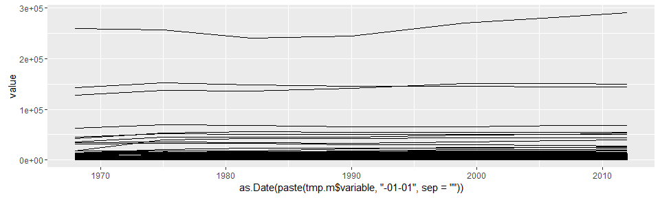<!-- -->


## rendre visible le graphique 


```r
tmp.m$Angers=tmp.m$Communes=="Angers" #"#CFCDCD", "#FFFFFF"

tmp.m=tmp.m[tmp.m$value>15000,]

ggplot(tmp.m) + geom_line(aes(x=as.Date(paste(tmp.m$variable,"-01-01",sep="")),
                              y=value,group=Communes,colour=Angers,size=Angers))+
  scale_y_sqrt()  +
scale_color_manual(values=c("#5E5C57", "red"))+
  scale_size_manual(values=c(1, 3))+
  geom_text(data=tmp.m[tmp.m$variable==2012,],aes(x = as.Date(paste(2012,"-01-01",sep=""))
,y=(value),label=Communes))
```
## souligné 

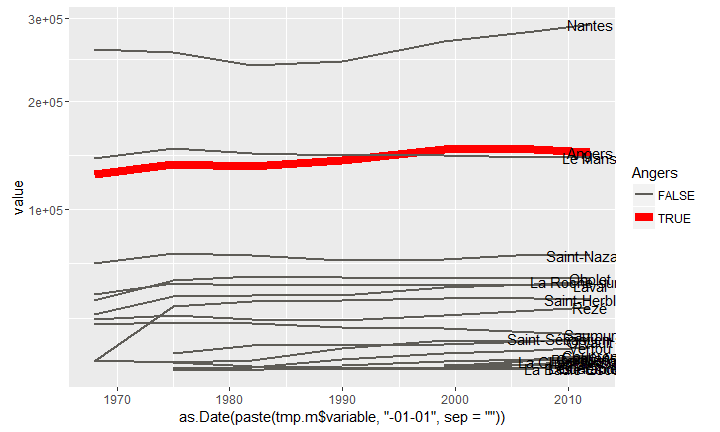<!-- -->

## Graphiques et modélisation


```r
ggplot(data = tmp.m[tmp.m$Communes=="Angers",], aes(x = variable,  y =value)) +
  geom_point() +geom_smooth()
```

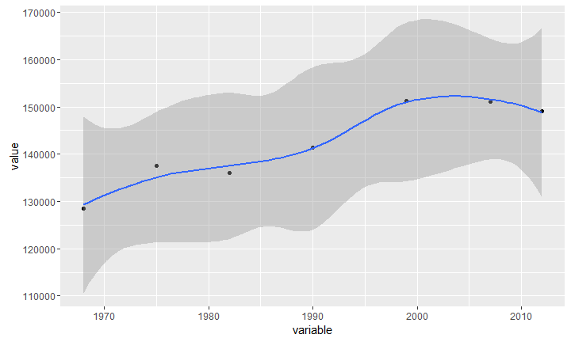<!-- -->

## Tendances à la hausse


```r
ggplot(data = tmp.m[tmp.m$Communes=="Angers",], aes(x = variable,  y =value)) +
  geom_point() +geom_smooth(method = "lm")
```

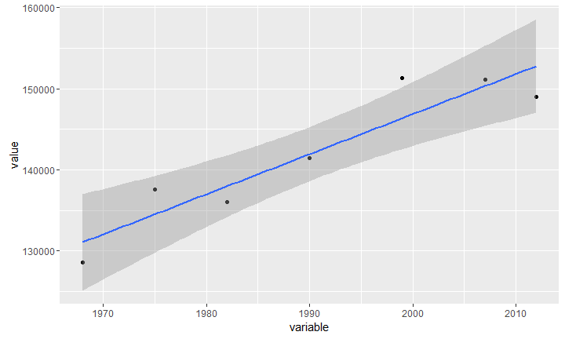<!-- -->


