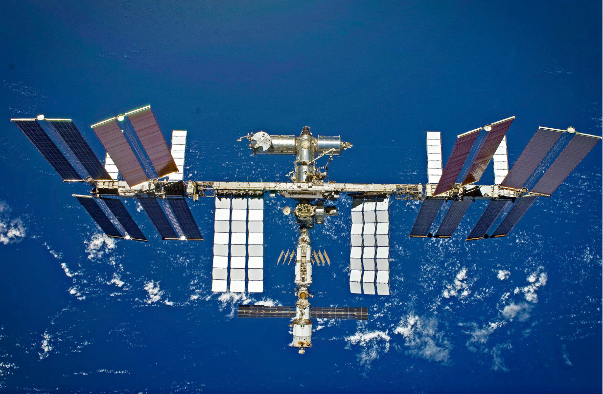

```{r setup, include=FALSE}
knitr::opts_chunk$set(echo = TRUE)
```

## API (Application programming interface)

En informatique, une interface de programmation applicative (souvent
désignée par le terme API pour application programming interface) est un
ensemble normalisé de classes, de méthodes ou de fonctions qui sert de
façade par laquelle un logiciel offre des services à d'autres logiciels.
Elle est offerte par une bibliothèque logicielle ou un service web, le
plus souvent accompagnée d'une description qui spécifie comment des
programmes consommateurs peuvent se servir des fonctionnalités du
programme fournisseur.

Dans l'industrie contemporaine du logiciel, les applications
informatiques se servent de nombreuses interfaces de programmation, la
programmation se fait en réutilisant des briques de fonctionnalités
fournies par des logiciels tiers. Cette construction par assemblage
nécessite pour le programmeur de connaître la manière d'interagir avec
les autres logiciels, qui dépend de leur interface de programmation. Le
programmeur n'a pas besoin de connaître les détails de la logique
interne du logiciel tiers, et celle-ci n'est généralement pas documentée
par le fournisseur.

Des logiciels tels que les systèmes d'exploitation, les systèmes de
gestion de base de données, les langages de programmation, ou les
serveurs d'applications comportent une interface de programmation.

## Exemple d'une API

"The International Space Station is moving at close to 28,000 km/h so
its location changes really fast! Where is it right now?"



Nous allons chercher les cordonnées spatiales de la station ISS :

-   Première étape: Chercher un json indiquant la position de la station

-   Seconde étape: convertir se JSON en data frame

-   Troisième étape: créer une carte interactive avec leaflet permettant
    de voir la position de la station

1.  Rechercher l'api qui permet de récupérer la position de la station
    via votre explorateur web préféré

2.  Une fois l'API trouvée vous allez pouvoir télécharger à l'aide de R
    la position de l'ISS. Installer pour cela le package htrr, qui
    permet de manipuler les fichier JSON.

3.  Utiliser la fonction`httr::GET()` afin de récupérer le fichier JSON
    de la requête, puis la fonction `httr::content()`,qui comme son nom
    l'indique vous donne le contenu du fichier Json.

    ```{r echo=FALSE}
    json = try(httr::GET("http://api.open-notify.org/iss-now.json",format="txt"))
    json

    ```

4.  Quelle est la classe de l'objet que vous avez récupéré ?

    ```{r echo=FALSE}
    df_json = try(content(json))
    df_json
    ```

5.  Transformer cet objet en data frame à l'aide de la fonction
    `as.data.frame().`

    ```{r API, echo=FALSE}
    #install.packages("devtools")

    #devtools::install_github("r-lib/httr")

     library(httr) ### télécharger le contenu d'une API


    json = try(httr::GET("http://api.open-notify.org/iss-now.json",format="txt"))
    df_json = try(as.data.frame(content(json),stringsAsFactors = F))
    df_json 
    ```

6.  Dessiner la position actuelle de la station ISS sur le globe
    terrestre.

```{r echo=FALSE}
library(ggplot2)

world <- map_data(map = "world")

ggplot() +
geom_point(data = df_json ,mapping = aes(y= as.numeric(`iss_position.latitude`), x = as.numeric(`iss_position.longitude`) ),group="position",color="red")


```

Un graphique un peu plus avancé avec la fonction `geom_quickmap()` &
`geom_polygon()`

```{r map 1 seule position, echo=FALSE}
library(maps)


ggplot(world, aes(long, lat, group = group)) +
geom_polygon(fill = "black", colour = "grey") +
coord_quickmap() +geom_point(data = df_json ,mapping = aes(y= as.numeric(`iss_position.latitude`), x = as.numeric(`iss_position.longitude`) ),group="position",color="red")


```

#### Trajectoire

Nous allons télécharger les positions de la station toutes les 10
secondes dans le but de "dessiner" sa trajectoire sur le globe.

Pour stocker les résultats de la requête nous allons enregistrer cette
data frame sous un format csv.

Après, le package GGplot2 va nous permettre de faire un graphe sur le
globe de la position de la station ISS.

Enfin, écrivez une boucle for afin pouvoir faire plusieurs requêtes du
même type.

```{r echo=FALSE}
if(file.exists("position.csv")){
  
} else{
  json = httr::GET("http://api.open-notify.org/iss-now.json",format="txt")
  df_json = as.data.frame(content(json),stringsAsFactors = F)
  write.csv(df_json,file = "position.csv",row.names = F)
  
  
  for (i in 1:50){
    print(i)
    Sys.sleep(10)
    json = httr::GET("http://api.open-notify.org/iss-now.json",format="txt")
    df_new = as.data.frame(content(json),stringsAsFactors = F)
    df_old =  readr::read_csv(file = "position.csv")
    df = rbind(df_old,df_new)
    print(head(df))
    write.csv(df,file = "position.csv",row.names = F)
    
  }
}
```

```{r}
library(ggplot2)
library(readr)

df <- read_csv("position.csv")

```

```{r echo=FALSE}
df$date = as.POSIXct(df$timestamp,origin = "1970-01-01")
ggplot_map = ggplot( data = df )

ggplot_map + 
  geom_point(mapping = aes(y= as.numeric(`iss_position.latitude`), x = as.numeric(`iss_position.longitude`) ))

```

Un graphique un peu plus avancé avec la fonction `geom_quickmap()` &
`geom_polygon()`

```{r echo=FALSE}
library(maps)

world <- map_data(map = "world")
df$time =df$timestamp- df$timestamp[1]
p = ggplot(data = df, aes(y= as.numeric(`iss_position.latitude`), x = as.numeric(`iss_position.longitude`) ) ) +geom_polygon(data=world, aes(long, lat, group = group),fill = "black", colour = "grey")+ coord_quickmap() +
geom_point(color="red")

p
```

###  Animation 

Avec la fonction du paquet `gganimate::transition_time()`

```{r gganim }

library(gganimate)
p+  transition_time(date)+
  labs(title = "Date: {frame_time}",
       x="Lon",
       y="Lat")


```
